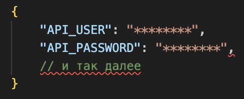
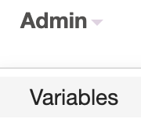

### Разворачиваем Apache AirFlow для запуска дагов в докере
- Клонируйте проект на свой локальный компьютер и перейти в папку `/infra/`:

```bash
git clone https://github.com/VladPronko/dags.git
```
- Создайте файл `variables` командой `touch variables.json` и добавьте в него переменные окружения для работы с дагами:


Позже вы сможете импортировать их из данного файле с помощью вэб-интерфейса:


- Добавьте необходимые зависимости в файл `requirements.txt`

- Создаем базовый докер-образ с нашими зависимостями:

```docker
docker build -t airflow_with_requirements .
```
- Запускаем airflow:
```docker
docker-compose up
```